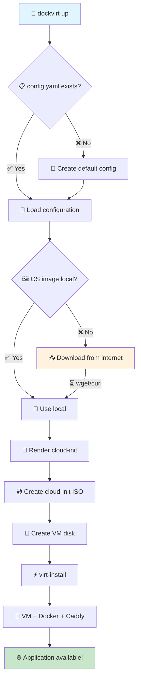
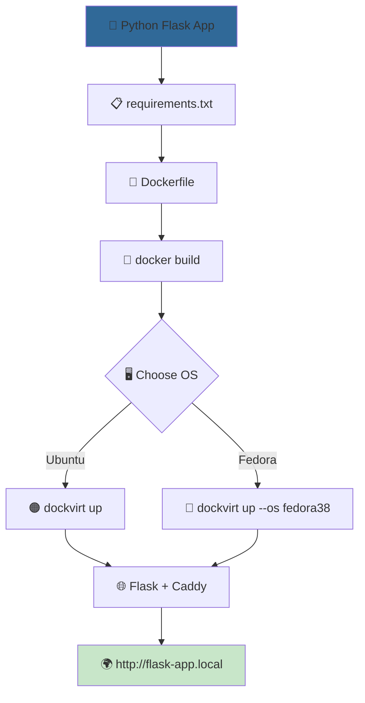

# dockvirt Usage Examples

This directory contains practical examples showing different ways to use `dockvirt` with the new, simplified API.

## 🏗️ How does dockvirt work?

### System Architecture

```
┌─────────────────────────────────────────────────────────────────┐
│                      🖥️  HOST SYSTEM                           │
├─────────────────────────────────────────────────────────────────┤
│  dockvirt CLI                                                   │
│  ┌─────────────┐ ┌─────────────┐ ┌─────────────┐               │
│  │ 📄 config.py │ │ 📥 image_   │ │ 🔧 vm_      │               │
│  │ (config)    │ │ manager.py  │ │ manager.py  │               │
│  │             │ │ (download)  │ │ (create VM) │               │
│  └─────────────┘ └─────────────┘ └─────────────┘               │
├─────────────────────────────────────────────────────────────────┤
│  ~/.dockvirt/                                                   │
│  ├── 📋 config.yaml    (configuration)                         │
│  ├── 📁 images/        (OS image cache)                        │
│  └── 📁 vm_name/       (cloud-init files)                      │
├─────────────────────────────────────────────────────────────────┤
│  🔄 libvirt/KVM                                                 │
│  ├── virt-install → creates VM                                 │
│  ├── virsh        → manages VM                                 │
│  └── qemu-kvm     → runs VM                                  │
└─────────────────────────────────────────────────────────────────┘
                               │
                               ▼
┌─────────────────────────────────────────────────────────────────┐
│                    🖥️  VIRTUAL MACHINE                         │
├─────────────────────────────────────────────────────────────────┤
│  🐧 Ubuntu/Fedora + cloud-init                                 │
│  ├── 🐳 Docker Engine                                          │
│  └── 📦 docker-compose                                         │
│      ├── 🌐 Caddy (reverse proxy :80/:443) ──┐                │
│      └── 📱 Your App Container               │                │
└──────────────────────────────────────────────┼─────────────────┘
                                               │
                                               ▼
                                    🌍 http://app.local
```

### VM Creation Flow



## 🆕 What's new?

All examples have been updated to use the latest features:

- **Automatic OS image downloads** - you no longer need to manually download `.qcow2` files
- **Configuration system** - `~/.dockvirt/config.yaml` with predefined settings
- **Simplified CLI** - instead of `--base-image` and `--os-variant`, just use `--os`

## 📋 List of examples

### [1. Static Nginx Website](./1-static-nginx-website/)


**Example flow:**
```
Developer      Docker         dockvirt       libvirt        Browser
    │              │              │             │              │
    ├─ build ────→ │              │             │              │
    │              ├─ nginx:alpine │             │              │  
    ├─ dockvirt up ───────────────→ │             │              │
    │              │              ├─ download ──→ │              │
    │              │              │  ubuntu.img   │              │
    │              │              ├─ virt-install → │              │
    │              │              │             ├─ VM + Docker  │
    │              │              │             ├─ Caddy proxy  │
    │              │              │             │              │
    ├─ add /etc/hosts ────────────────────────────────────────→ │
    │              │              │             │              ├─ GET /
    │              │              │             │              │
```

### [2. Python (Flask) Web Application](./2-python-flask-app/)



**System comparison:**
```
Ubuntu 22.04                     Fedora 38
     │                               │
     ├─ apt-get update               ├─ dnf update
     ├─ install docker               ├─ install docker
     ├─ pip install requirements     ├─ pip install requirements
     ├─ docker compose up            ├─ docker compose up
     │                               │
     └─ ~2-3 min startup             └─ ~2-4 min startup
```

### [3. Operating System Comparison](./3-multi-os-comparison/)


**System configuration:**
```
┌─────────────────────────────────────────┐
│ ~/.dockvirt/config.yaml                 │
├─────────────────────────────────────────┤
│ default_os: ubuntu22.04                 │
│ images:                                 │
│   ubuntu22.04:                         │
│     url: https://cloud-images.ubuntu... │
│     variant: ubuntu22.04               │
│   fedora38:                            │
│     url: https://download.fedora...     │ 
│     variant: fedora-cloud-base-38       │
│   debian12:     # Your configuration   │
│     url: https://cloud.debian.org...    │
│     variant: debian12                   │
└─────────────────────────────────────────┘
```

## 🚀 Quick start

### 🔍 Check system readiness
```bash
# Check if all dependencies are installed
dockvirt check

# If something is missing, install automatically
dockvirt setup --install
```

### Option 1: Use a .dockvirt file (recommended)

```bash
# Go to any example
cd examples/1-static-nginx-website

# Build the Docker image
docker build -t my-static-website:latest .

# Just run - the parameters are in the .dockvirt file
dockvirt up
```

### Option 2: Traditional CLI parameters

```bash
# Run with default Ubuntu 22.04
dockvirt up \
  --name my-test \
  --domain my-test.local \
  --image example-app:latest \
  --port 80

# Or choose Fedora
dockvirt up --os fedora38
```

### 📝 Example .dockvirt file

```bash
# .dockvirt
name=my-app
domain=my-app.local  
image=my-app:latest
port=80
os=ubuntu22.04
```

## 🔧 Requirements

Before running the examples, make sure you have:
- `dockvirt` installed: `pip install dockvirt`
- All dependencies: `dockvirt check`
- If something is missing: `dockvirt setup --install`

### 📊 Automatic testing
```bash
# Test all examples on different OS
python ../scripts/test_examples.py

# Test only one example
python ../scripts/test_examples.py 1-static-nginx-website

# The test report will be saved in test_results.md
```

## 💡 Tips

- Each example has its own `.dockvirt` file with default parameters
- You can edit `.dockvirt` to change the VM name, port, or OS
- Use `dockvirt down --name <name>` to remove a VM
- Use `dockvirt ip --name <name>` to check the VM's IP
- The examples work with both Ubuntu and Fedora

### 🧪 Compatibility testing
The test script checks:
- ✅ Building the Docker image
- ✅ Creating a VM with Ubuntu 22.04  
- ✅ Creating a VM with Fedora 38
- ✅ HTTP availability of the application
- ✅ Cleaning up resources after tests

## 🆘 Help

If you encounter problems:
1. Check if libvirt is running: `sudo systemctl status libvirtd`
2. Check the VM logs: `virsh console <vm-name>`
3. See the configuration: `cat ~/.dockvirt/config.yaml`
4. Check the downloaded images: `ls -la ~/.dockvirt/images/`
