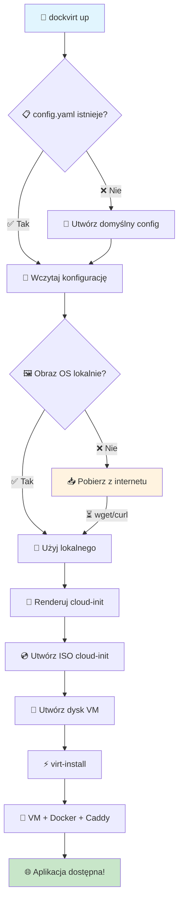
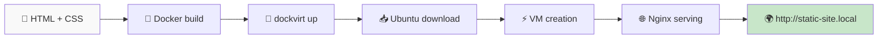
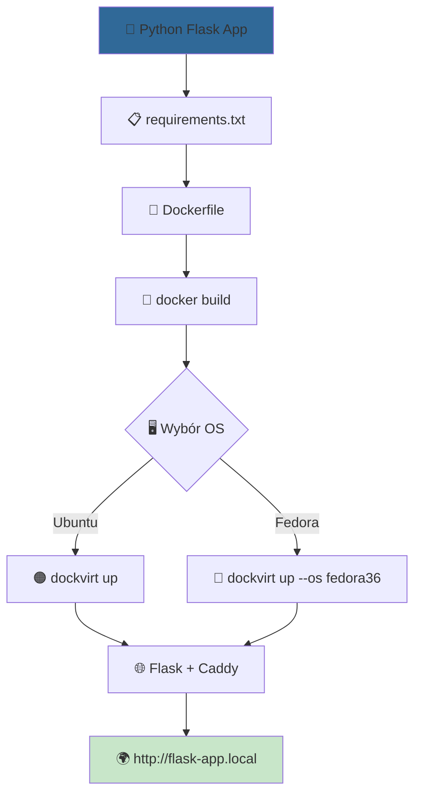
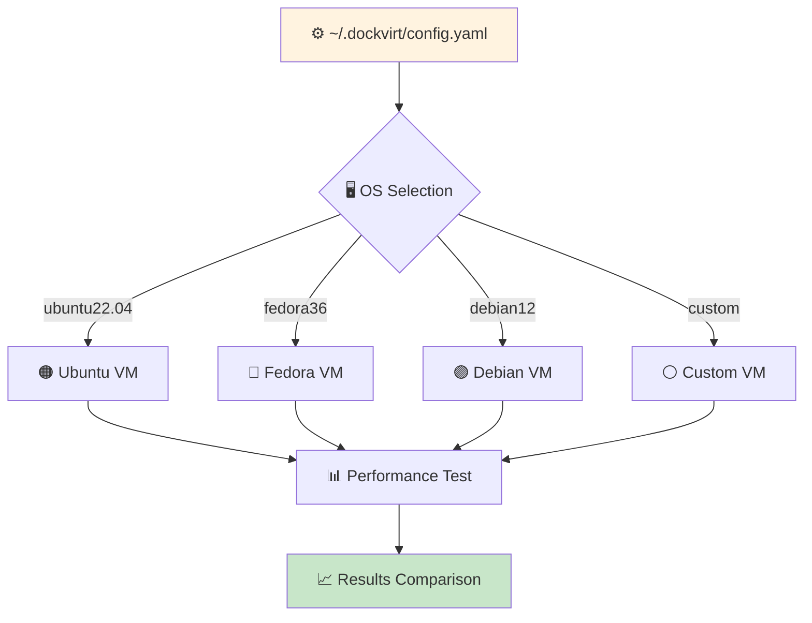

# Przykłady użycia dockvirt

Ten katalog zawiera praktyczne przykłady pokazujące różne sposoby użycia `dockvirt` z nowym, uproszczonym API.

## 🏗️ Jak działa dockvirt?

### Architektura systemu

```
┌─────────────────────────────────────────────────────────────────┐
│                      🖥️  HOST SYSTEM                           │
├─────────────────────────────────────────────────────────────────┤
│  dockvirt CLI                                                   │
│  ┌─────────────┐ ┌─────────────┐ ┌─────────────┐               │
│  │ 📄 config.py │ │ 📥 image_   │ │ 🔧 vm_      │               │
│  │ (config)    │ │ manager.py  │ │ manager.py  │               │
│  │             │ │ (download)  │ │ (create VM) │               │
│  └─────────────┘ └─────────────┘ └─────────────┘               │
├─────────────────────────────────────────────────────────────────┤
│  ~/.dockvirt/                                                   │
│  ├── 📋 config.yaml    (konfiguracja)                          │
│  ├── 📁 images/        (cache obrazów OS)                      │
│  └── 📁 vm_name/       (pliki cloud-init)                      │
├─────────────────────────────────────────────────────────────────┤
│  🔄 libvirt/KVM                                                 │
│  ├── virt-install → tworzy VM                                  │
│  ├── virsh        → zarządza VM                                │
│  └── qemu-kvm     → uruchamia VM                               │
└─────────────────────────────────────────────────────────────────┘
                               │
                               ▼
┌─────────────────────────────────────────────────────────────────┐
│                    🖥️  VIRTUAL MACHINE                         │
├─────────────────────────────────────────────────────────────────┤
│  🐧 Ubuntu/Fedora + cloud-init                                 │
│  ├── 🐳 Docker Engine                                          │
│  └── 📦 docker-compose                                         │
│      ├── 🌐 Caddy (reverse proxy :80/:443) ──┐                │
│      └── 📱 Your App Container               │                │
└──────────────────────────────────────────────┼─────────────────┘
                                               │
                                               ▼
                                    🌍 http://app.local
```

### Przepływ tworzenia VM



## 🆕 Co nowego?

Wszystkie przykłady zostały zaktualizowane, aby korzystać z najnowszych funkcji:

- **Automatyczne pobieranie obrazów OS** - nie musisz już ręcznie pobierać plików `.qcow2`
- **System konfiguracji** - `~/.dockvirt/config.yaml` z predefiniowanymi ustawieniami
- **Uproszczone CLI** - zamiast `--base-image` i `--os-variant`, wystarczy `--os`

## 📋 Lista przykładów

### [1. Statyczna strona na Nginx](./1-static-nginx-website/)



**Przepływ przykładu:**
```
Developer      Docker         dockvirt       libvirt        Browser
    │              │              │             │              │
    ├─ build ────→ │              │             │              │
    │              ├─ nginx:alpine │             │              │  
    ├─ dockvirt up ───────────────→ │             │              │
    │              │              ├─ download ──→ │              │
    │              │              │  ubuntu.img   │              │
    │              │              ├─ virt-install → │              │
    │              │              │             ├─ VM + Docker  │
    │              │              │             ├─ Caddy proxy  │
    │              │              │             │              │
    ├─ add /etc/hosts ────────────────────────────────────────→ │
    │              │              │             │              ├─ GET /
    │              │              │             │              │
```

### [2. Aplikacja webowa w Pythonie (Flask)](./2-python-flask-app/)



**Porównanie systemów:**
```
Ubuntu 22.04                     Fedora 36
     │                               │
     ├─ apt-get update               ├─ dnf update
     ├─ install docker               ├─ install docker
     ├─ pip install requirements     ├─ pip install requirements
     ├─ docker compose up            ├─ docker compose up
     │                               │
     └─ ~2-3 min startup             └─ ~2-4 min startup
```

### [3. Porównanie systemów operacyjnych](./3-multi-os-comparison/)



**Konfiguracja systemu:**
```
┌─────────────────────────────────────────┐
│ ~/.dockvirt/config.yaml                 │
├─────────────────────────────────────────┤
│ default_os: ubuntu22.04                 │
│ images:                                 │
│   ubuntu22.04:                         │
│     url: https://cloud-images.ubuntu... │
│     variant: ubuntu22.04               │
│   fedora36:                            │
│     url: https://download.fedora...     │ 
│     variant: fedora-cloud-base-36       │
│   debian12:     # Twoja konfiguracja   │
│     url: https://cloud.debian.org...    │
│     variant: debian12                   │
└─────────────────────────────────────────┘
```

## 🚀 Szybki start

### Opcja 1: Użyj pliku .dockvirt (rekomendowane)

```bash
# Przejdź do dowolnego przykładu
cd examples/1-static-nginx-website

# Zbuduj obraz Dockera
docker build -t my-static-website:latest .

# Po prostu uruchom - parametry są w pliku .dockvirt
dockvirt up
```

### Opcja 2: Tradycyjne parametry CLI

```bash
# Uruchom z domyślnym Ubuntu 22.04
dockvirt up \
  --name my-test \
  --domain my-test.local \
  --image example-app:latest \
  --port 80

# Lub wybierz Fedorę
dockvirt up --os fedora36
```

### 📝 Przykład pliku .dockvirt

```bash
# .dockvirt
name=my-app
domain=my-app.local  
image=my-app:latest
port=80
os=ubuntu22.04
```

## 🔧 Wymagania

Przed uruchomieniem przykładów upewnij się, że masz:
- Zainstalowany `dockvirt`: `pip install dockvirt`
- Docker do budowania obrazów aplikacji
- Odpowiednie uprawnienia do uruchamiania VM (libvirt)

## 💡 Wskazówki

1. **Pierwsze uruchomienie**: Może trwać dłużej z powodu pobierania obrazów OS
2. **Cache**: Kolejne uruchomienia będą znacznie szybsze dzięki lokalnym obrazom
3. **Debugowanie**: Użyj `virsh list --all` aby zobaczyć wszystkie VM
4. **Czyszczenie**: Zawsze używaj `dockvirt down --name <nazwa>` aby usunąć VM

## 🆘 Pomoc

Jeśli napotkasz problemy:
1. Sprawdź czy libvirt działa: `sudo systemctl status libvirtd`
2. Sprawdź logi VM: `virsh console <nazwa-vm>`
3. Zobacz konfigurację: `cat ~/.dockvirt/config.yaml`
4. Sprawdź pobrane obrazy: `ls -la ~/.dockvirt/images/`
