```mermaid
flowchart LR
    A[📝 HTML + CSS] --> B[🐳 Docker build]
    B --> C[🚀 dockvirt up]
    C --> D[📥 Ubuntu download]
    D --> E[⚡ VM creation]
    E --> F[🌐 Nginx serving]
    F --> G[🌍 http://static-site.local]
    
    style A fill:#f9f9f9
    style G fill:#c8e6c9
```

```mermaid
flowchart TD
    A[⚙️ ~/.dockvirt/config.yaml] --> B{🖥️ OS Selection}
    B -->|ubuntu22.04| C[🟠 Ubuntu VM]
    B -->|fedora38| D[🔵 Fedora VM]  
    B -->|debian12| E[🟣 Debian VM]
    B -->|custom| F[⚪ Custom VM]
    
    C --> G[📊 Performance Test]
    D --> G
    E --> G
    F --> G
    
    G --> H[📈 Results Comparison]
    
    style A fill:#fff3e0
    style H fill:#c8e6c9
```

# Przykłady użycia dockvirt

Ten katalog zawiera praktyczne przykłady pokazujące różne sposoby użycia `dockvirt` z nowym, uproszczonym API.

## 🏗️ Jak działa dockvirt?

### Architektura systemu

```
┌─────────────────────────────────────────────────────────────────┐
│                      🖥️  HOST SYSTEM                           │
├─────────────────────────────────────────────────────────────────┤
│  dockvirt CLI                                                   │
│  ┌─────────────┐ ┌─────────────┐ ┌─────────────┐               │
│  │ 📄 config.py │ │ 📥 image_   │ │ 🔧 vm_      │               │
│  │ (config)    │ │ manager.py  │ │ manager.py  │               │
│  │             │ │ (download)  │ │ (create VM) │               │
│  └─────────────┘ └─────────────┘ └─────────────┘               │
├─────────────────────────────────────────────────────────────────┤
│  ~/.dockvirt/                                                   │
│  ├── 📋 config.yaml    (konfiguracja)                          │
│  ├── 📁 images/        (cache obrazów OS)                      │
│  └── 📁 vm_name/       (pliki cloud-init)                      │
├─────────────────────────────────────────────────────────────────┤
│  🔄 libvirt/KVM                                                 │
│  ├── virt-install → tworzy VM                                  │
│  ├── virsh        → zarządza VM                                │
│  └── qemu-kvm     → uruchamia VM                               │
└─────────────────────────────────────────────────────────────────┘
                               │
                               ▼
┌─────────────────────────────────────────────────────────────────┐
│                    🖥️  VIRTUAL MACHINE                         │
├─────────────────────────────────────────────────────────────────┤
│  🐧 Ubuntu/Fedora + cloud-init                                 │
│  ├── 🐳 Docker Engine                                          │
│  └── 📦 docker-compose                                         │
│      ├── 🌐 Caddy (reverse proxy :80/:443) ──┐                │
│      └── 📱 Your App Container               │                │
└──────────────────────────────────────────────┼─────────────────┘
                                               │
                                               ▼
                                    🌍 http://app.local
```

### Przepływ tworzenia VM

```mermaid
flowchart TD
    A[🚀 dockvirt up] --> B{📋 config.yaml istnieje?}
    B -->|❌ Nie| C[📝 Utwórz domyślny config]
    B -->|✅ Tak| D[📖 Wczytaj konfigurację]
    C --> D
    
    D --> E{🖼️ Obraz OS lokalnie?}
    E -->|❌ Nie| F[📥 Pobierz z internetu]
    E -->|✅ Tak| G[💾 Użyj lokalnego]
    F --> |⏳ wget/curl| G
    
    G --> H[🔧 Renderuj cloud-init]
    H --> I[💿 Utwórz ISO cloud-init]
    I --> J[💽 Utwórz dysk VM]
    J --> K[⚡ virt-install]
    K --> L[🐳 VM + Docker + Caddy]
    L --> M[🌐 Aplikacja dostępna!]
    
    style A fill:#e1f5fe
    style M fill:#c8e6c9
    style F fill:#fff3e0
```



## 🆕 Co nowego?

Wszystkie przykłady zostały zaktualizowane, aby korzystać z najnowszych funkcji:

- **Automatyczne pobieranie obrazów OS** - nie musisz już ręcznie pobierać plików `.qcow2`
- **System konfiguracji** - `~/.dockvirt/config.yaml` z predefiniowanymi ustawieniami
- **Uproszczone CLI** - zamiast `--base-image` i `--os-variant`, wystarczy `--os`

## 📋 Lista przykładów

### [1. Statyczna strona na Nginx](./1-static-nginx-website/)



**Przepływ przykładu:**
```
Developer      Docker         dockvirt       libvirt        Browser
    │              │              │             │              │
    ├─ build ────→ │              │             │              │
    │              ├─ nginx:alpine │             │              │  
    ├─ dockvirt up ───────────────→ │             │              │
    │              │              ├─ download ──→ │              │
    │              │              │  ubuntu.img   │              │
    │              │              ├─ virt-install → │              │
    │              │              │             ├─ VM + Docker  │
    │              │              │             ├─ Caddy proxy  │
    │              │              │             │              │
    ├─ add /etc/hosts ────────────────────────────────────────→ │
    │              │              │             │              ├─ GET /
    │              │              │             │              │
```

### [2. Aplikacja webowa w Pythonie (Flask)](./2-python-flask-app/)

```mermaid
flowchart TD
    A[🐍 Python Flask App] --> B[📋 requirements.txt]
    B --> C[🐳 Dockerfile]
    C --> D[🔨 docker build]
    D --> E{🖥️ Wybór OS}
    E -->|Ubuntu| F[🟠 dockvirt up]
    E -->|Fedora| G[🔵 dockvirt up --os fedora38]
    F --> H[🌐 Flask + Caddy]
    G --> H
    H --> I[🌍 http://flask-app.local]
    
    style A fill:#306998
    style I fill:#c8e6c9
```



**Porównanie systemów:**
```
Ubuntu 22.04                     Fedora 38
     │                               │
     ├─ apt-get update               ├─ dnf update
     ├─ install docker               ├─ install docker
     ├─ pip install requirements     ├─ pip install requirements
     ├─ docker compose up            ├─ docker compose up
     │                               │
     └─ ~2-3 min startup             └─ ~2-4 min startup
```

### [3. Porównanie systemów operacyjnych](./3-multi-os-comparison/)



**Konfiguracja systemu:**
```
┌─────────────────────────────────────────┐
│ ~/.dockvirt/config.yaml                 │
├─────────────────────────────────────────┤
│ default_os: ubuntu22.04                 │
│ images:                                 │
│   ubuntu22.04:                         │
│     url: https://cloud-images.ubuntu... │
│     variant: ubuntu22.04               │
│   fedora38:                            │
│     url: https://download.fedora...     │ 
│     variant: fedora-cloud-base-38       │
│   debian12:     # Twoja konfiguracja   │
│     url: https://cloud.debian.org...    │
│     variant: debian12                   │
└─────────────────────────────────────────┘
```

## 🚀 Szybki start

### 🔍 Sprawdź gotowość systemu
```bash
# Sprawdź czy wszystkie zależności są zainstalowane
dockvirt check

# Jeśli coś brakuje, zainstaluj automatycznie
dockvirt setup --install
```

### Opcja 1: Użyj pliku .dockvirt (rekomendowane)

```bash
# Przejdź do dowolnego przykładu
cd examples/1-static-nginx-website

# Zbuduj obraz Dockera
docker build -t my-static-website:latest .

# Po prostu uruchom - parametry są w pliku .dockvirt
dockvirt up
```

### Opcja 2: Tradycyjne parametry CLI

```bash
# Uruchom z domyślnym Ubuntu 22.04
dockvirt up \
  --name my-test \
  --domain my-test.local \
  --image example-app:latest \
  --port 80

# Lub wybierz Fedorę
dockvirt up --os fedora38
```

### 📝 Przykład pliku .dockvirt

```bash
# .dockvirt
name=my-app
domain=my-app.local  
image=my-app:latest
port=80
os=ubuntu22.04
```

## 🔧 Wymagania

Przed uruchomieniem przykładów upewnij się, że masz:
- Zainstalowany `dockvirt`: `pip install dockvirt`
- Wszystkie zależności: `dockvirt check`
- Jeśli coś brakuje: `dockvirt setup --install`

### 📊 Automatyczne testowanie
```bash
# Testuj wszystkie przykłady na różnych systemach OS
python ../scripts/test_examples.py

# Testuj tylko jeden przykład
python ../scripts/test_examples.py 1-static-nginx-website

# Raport z testów zostanie zapisany w test_results.md
```

## 💡 Wskazówki

- Każdy przykład ma swój plik `.dockvirt` z domyślnymi parametrami
- Możesz edytować `.dockvirt` aby zmienić nazwę VM, port, lub OS
- Użyj `dockvirt down --name <nazwa>` aby usunąć VM
- Użyj `dockvirt ip --name <nazwa>` aby sprawdzić IP VM
- Przykłady działają zarówno z Ubuntu jak i Fedora

### 🧪 Testowanie kompatybilności
Script testowy sprawdza:
- ✅ Budowanie obrazu Docker
- ✅ Tworzenie VM z Ubuntu 22.04  
- ✅ Tworzenie VM z Fedora 38
- ✅ Dostępność HTTP aplikacji
- ✅ Czyszczenie zasobów po testach

## 🆘 Pomoc

Jeśli napotkasz problemy:
1. Sprawdź czy libvirt działa: `sudo systemctl status libvirtd`
2. Sprawdź logi VM: `virsh console <nazwa-vm>`
3. Zobacz konfigurację: `cat ~/.dockvirt/config.yaml`
4. Sprawdź pobrane obrazy: `ls -la ~/.dockvirt/images/`
